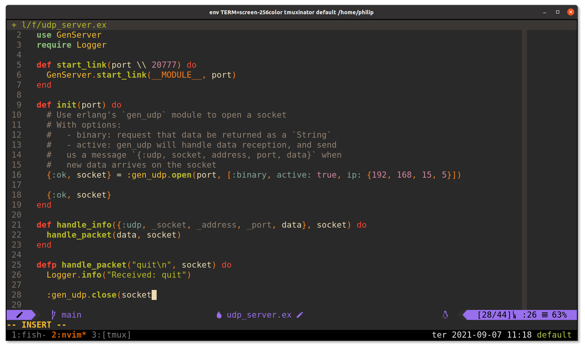

# dot files

Most of my configuration files.

## General dependencies

- [alacritty](https://github.com/alacritty/alacritty)
- [asdf](https://github.com/asdf-vm/asdf)
- [fish](https://fishshell.com/) and [Oh-my-fish](https://github.com/oh-my-fish/oh-my-fish#installation)
- [neovim](https://github.com/neovim/neovim)
- [nerd-fonts](https://github.com/ryanoasis/nerd-fonts)
- [rustup](https://rustup.rs/)
- [tmux](https://github.com/tmux/tmux)

## Command line tools

- [bat](https://github.com/sharkdp/bat)
- [delta](https://github.com/dandavison/delta)
- [fd-find](https://github.com/sharkdp/fd)
- [ripgrep](https://github.com/BurntSushi/ripgrep)

## License

Some of those files were based on other projects.
Please check the file and follow those projects for license and stuff.
Everything made here is license under MIT license.
